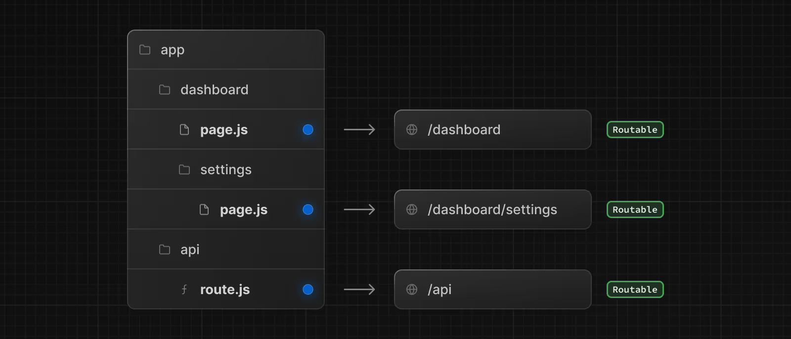
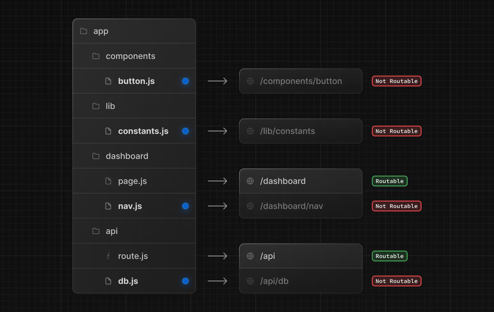

# Next.js
Next.js is a React framework for building full-stack web applications. You use React Components to build user interfaces, and Next.js for additional features and optimizations.

Under the hood, Next.js also abstracts and automatically configures tooling needed for React, like bundling, compiling, and more. This allows you to focus on building your application instead of spending time with configuration.

Whether you're an individual developer or part of a larger team, Next.js can help you build interactive, dynamic, and fast React applications.

## Installation
```
npx create-next-app@latest
```

## Routing
In the app directory, nested folder hierarchy defines route structure. Each folder represents a route segment that is mapped to a corresponding segment in a URL path.

However, even though route structure is defined through folders, a route is not publicly accessible until a *page.js* or *route.js* file is added to a route segment.

And, even when a route is made publicly accessible, only the content returned by page.js or route.js is sent to the client.



This means that project files can be safely colocated inside route segments in the app directory without accidentally being routable.


