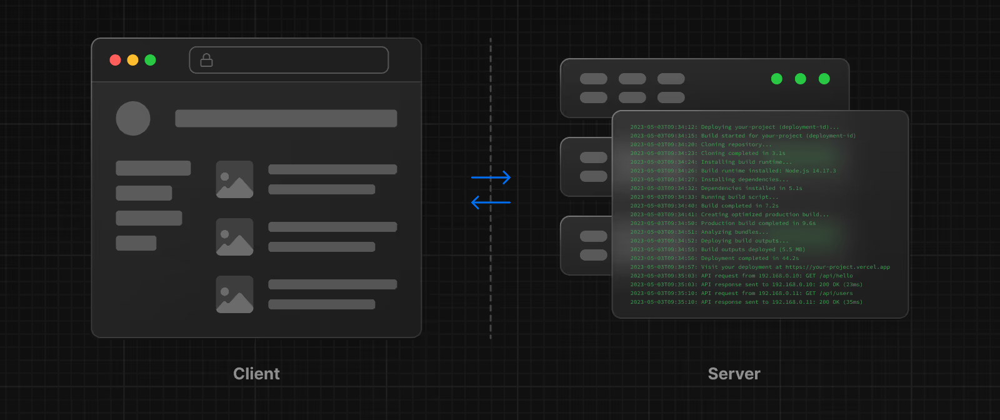

# Rendering
Rendering converts the code you write into user interfaces. React and Next.js allow you to create hybrid web applications where parts of your code can be rendered on the server or the client.

## Rendering Environments
There are two environments where web applications can be rendered: the client and the server.

**-** The client refers to the browser on a user's device that sends a request to a server for your application code. It then turns the response from the server into a user interface.

**-** The server refers to the computer in a data center that stores your application code, receives requests from a client, and sends back an appropriate response.

 -**By default, Next.js uses Server Components.**\
 This allows you to automatically implement server rendering with no additional configuration, and you can opt into using Client Components when needed ,\
 To use Client Components, you can add the React **"use client"** directive at the top of a file, above your imports.

-To use useState or other React hooks , first we have to make it a client component by adding 'use client' or it will give error.